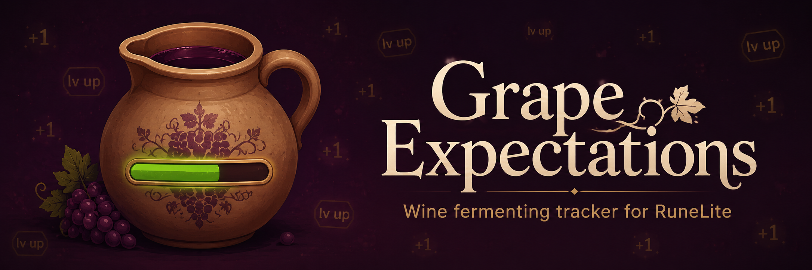
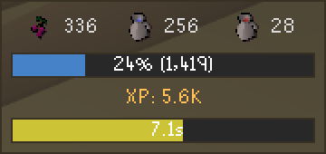

  

<h1 align="center">Grape Expectations</h1>

Grape Expectations is a RuneLite plugin that keeps an eye on your wine while it ferments. As you turn grapes and jugs of water into wine, a compact overlay shows what you're holding, the Cooking XP the current batch will bank, how close that puts you to your next level, and a live countdown until the wine is done. It only tracks standard wine — **grapes + jug of water → unfermented wine → jug of wine** — and every number accounts for the level-based chance of a wine spoiling, so what you see is what you can actually expect.

## Features

### The fermenting overlay

- **Your whole batch at a glance**

  A small, draggable box sits on the game screen while you make wine, updating on its own. It only appears when you're holding something relevant, and each row can be turned off if you'd rather keep it minimal.

  

- **Inventory counts**

  Grapes, jugs of water, and fermenting wine you're holding, each with its icon. Wine left fermenting in your bank counts too, so a batch you banked isn't forgotten.

- **Projected level**

  A progress bar showing where the current batch's XP lands you, labelled with the percent into the level and — if you like — how many more wines you need to reach the next one. That estimate counts down live as you make wine, not only once the batch ferments.

- **Estimated XP**

  The Cooking XP the batch will bank once it ferments. Once your Cooking is high enough that fermenting can no longer fail, it drops the guesswork and shows the exact figure.

- **Ferment timer**

  A smooth countdown of the seconds until the batch is done, with the bar shading from green through yellow to red as the time runs out.

### Numbers you can trust

- **Expected XP, not a best case**

  Below level 68 some wine ferments into bad wine and gives nothing. Grape Expectations uses the real level-based success chance, so the banked XP and the level projection reflect what you'll actually get — not a lucky run.

### Make it yours

- **Show only what you want**

  Toggle any of the four rows and the wines-to-next-level figure, and recolor the estimated-XP text and the level bar to taste.

## Links

- [Report a bug](https://github.com/Oveduumnakal/Grape-Expectations-Plugin/issues/new?template=bug_report.yml)
- [Request a feature](https://github.com/Oveduumnakal/Grape-Expectations-Plugin/issues/new?template=feature_request.yml)
- [Buy me a coffee](https://buymeacoffee.com/oveduumnakal)
